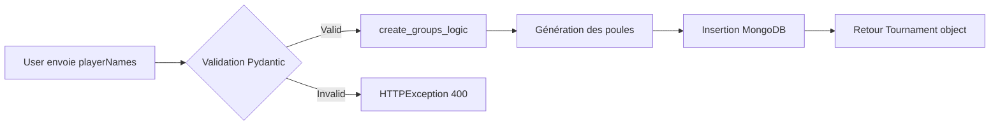

# ARCHITECTURE_LOG - Tournoi FC26

> **Documentation technique de l'architecture réseau et API**  
> **Dernière mise à jour:** 2026-02-15  
> **Projet:** Tournoi FC26 (Gestion de tournois EA FC)

---

## 📡 Configuration Réseau & Ports

### Ports Actifs

| Service | Port | Technologie | Environnement | État |
|---------|------|-------------|---------------|------|
| **Backend** | `8000` | FastAPI + Uvicorn | Python 3.x | ✅ Running |
| **Frontend** | `3000` | React + Vite | Node.js | ✅ Running |
| **MongoDB** | Variable (MONGO_URL) | Motor (AsyncIO) | Cloud/Local | ✅ Connected |

### CORS Configuration

**Origines autorisées :**
```python
origins = [
    "https://tournoi-fc26-1.onrender.com",
    "https://tournoi-fc26.onrender.com",
    "http://localhost:3000",
    "http://127.0.0.1:3000"
]
```

**Politique :**
- `allow_credentials: True` → Cookies/Auth autorisés
- `allow_methods: ["*"]` → Tous les verbes HTTP acceptés
- `allow_headers: ["*"]` → Headers personnalisés autorisés

---

## 🛣️ Routes API Backend

### Authentification (`/api/auth`)

| Méthode | Route | Rate Limit | Authentification | Description |
|---------|-------|------------|------------------|-------------|
| `POST` | `/api/auth/register` | 5/min | ❌ Aucune | Création de compte (1er user = super_admin) |
| `POST` | `/api/auth/login` | 10/min | ❌ Aucune | Login + génération JWT (30min) |
| `PUT` | `/api/auth/profile` | - | ✅ JWT | Mise à jour username/password |

**Sécurité appliquée :**
- Bcrypt pour le hashing des mots de passe
- JWT (HS256) avec expiration 30min
- Regex stricte pour username : `^[a-zA-Z0-9_.-]{3,30}$`
- Password minimum 8 caractères

---

### Administration (`/api/admin`)

| Méthode | Route | Rôle requis | Description |
|---------|-------|-------------|-------------|
| `GET` | `/api/admin/users/pending` | `super_admin` | Liste des comptes en attente |
| `GET` | `/api/admin/users` | `super_admin` | Tous les utilisateurs |
| `POST` | `/api/admin/users/{username}/approve` | `super_admin` | Approuver un compte |
| `POST` | `/api/admin/users/{username}/reject` | `super_admin` | Rejeter un compte |
| `DELETE` | `/api/admin/users/{username}` | `super_admin` | Supprimer un utilisateur |

**Logique de validation des comptes :**
1. Premier utilisateur créé → `super_admin` (auto-actif)
2. Utilisateurs suivants → `admin` (status = `pending`)
3. Seul le super_admin peut activer/rejeter les demandes

---

### Tournois (`/api/tournament`, `/api/tournaments`)

#### Routes Publiques

| Méthode | Route | Authentification | Description |
|---------|-------|------------------|-------------|
| `GET` | `/api/tournaments/public` | ❌ Aucune | Top 20 tournois récents |
| `GET` | `/api/tournament/{tournament_id}` | ❌ Aucune | Détails d'un tournoi |

#### Routes Authentifiées

| Méthode | Route | Description |
|---------|-------|-------------|
| `POST` | `/api/tournament` | Créer un tournoi (min 4, max 64 joueurs) |
| `GET` | `/api/tournaments/my-tournaments` | Tournois créés par l'utilisateur connecté |
| `DELETE` | `/api/tournament/{tournament_id}` | Supprimer son tournoi (ou super_admin) |

#### Gestion des Matchs

| Méthode | Route | Description |
|---------|-------|-------------|
| `POST` | `/api/tournament/{tournament_id}/match/{match_id}/score` | Enregistrer un score (0-99 max) |
| `POST` | `/api/tournament/{tournament_id}/complete_groups` | Clôturer la phase de poule → génère le tableau éliminatoire |
| `POST` | `/api/tournament/{tournament_id}/redraw_knockout` | Retirer les matchs éliminatoires |
| `POST` | `/api/tournament/{tournament_id}/generate_next_round` | Générer le tour suivant (mode 2v2 uniquement) |

---

### Utilitaires

| Méthode | Route | Description |
|---------|-------|-------------|
| `GET` | `/` | Health check (root) |
| `GET` | `/api/status` | Health check API |
| `POST` | `/api/test-security` | Test de résilience anti-injection NoSQL |

---

## 🧠 Logique Métier Critique

### 1. Création de Tournoi (`create_tournament`)

**Fichier:** `server.py:539-569`

**Flux d'exécution :**


**Validations appliquées :**
- Min 4 joueurs, Max 64
- Sanitization XSS via `bleach.clean()`
- Vérification doublons après nettoyage
- Format `1v1` ou `2v2` uniquement
- Si 2v2 : nombre de joueurs pair obligatoire

---

### 2. Calcul Automatique des Poules (`create_groups_logic`)

**Fichier:** `server.py:431-464`

**Logique :**
```python
# Stratégie auto-balancée
total_entities = len(players)
num_groups_auto = math.ceil(total_entities / 4)

# Ajustement pour éviter les poules à 1 joueur
if total_entities > 8 and (total_entities % 4 in [1, 2]):
    num_groups_auto = math.floor(total_entities / 4)
```

**Exemple :**
- 13 joueurs → `ceil(13/4) = 4` poules... MAIS `13 % 4 = 1` → Ajustement à `floor(13/4) = 3` poules
- Résultat : Poules de 5, 4, 4 joueurs (plus équilibré)

**Mode 2v2 :**
- Les joueurs sont groupés par paires avant la création des poules
- Un joueur impair forme une équipe solo

---

### 3. Mise à Jour Classement (`update_group_standings_logic`)

**Fichier:** `server.py:466-484`

**Critères de tri (ordre décroissant) :**
1. **Points** (victoire = 3, nul = 1, défaite = 0)
2. **Différence de buts** (`goalsFor - goalsAgainst`)
3. **Buts marqués** (départage final)

**Pourquoi cette logique ?**  
Suit les règles standards des compétitions de football (UEFA, FIFA).

---

### 4. Qualification Automatique (`determine_qualifiers_logic`)

**Fichier:** `server.py:486-513`

**Règles :**
```python
if total_entities <= 8:
    target = 4  # Demi-finales
elif total_entities <= 16:
    target = 8  # Quarts
else:
    target = 16 if total_entities >= 24 else 8
```

**Distribution :**
- Si `target % num_groups == 0` → Qualification uniforme (ex: 8 qualifiés, 4 poules → 2/poule)
- Sinon → Meilleurs 2e/3e repêchés selon points/goalDiff/goalsFor

---

### 5. Génération Tableau Éliminatoire (`generate_knockout_matches_logic`)

**Fichier:** `server.py:515-535`

**Spécificités :**
- **Mode 1v1 :** Arbre complet jusqu'à la finale + petite finale (si ≥4 joueurs)
- **Mode 2v2 :** Un seul tour (`single_round=True`), puis `generate_next_round` pour remixer les équipes

**Shuffle automatique :** Les qualifiés sont mélangés aléatoirement pour éviter de recroiser des adversaires de poule immédiatement.

---

### 6. Remaniement Équipes 2v2 (`complete_groups_and_draw_knockout`)

**Fichier:** `server.py:571-623`

**Logique anti-redondance :**
```python
# Détection des équipes précédentes
previous_teams_sets = [set(p.real_players) for p in all_players]

# Algorithme de shuffle (max 100 tentatives)
while attempts < 100:
    shuffle(individual_pool)
    if current_pair not in previous_teams_sets:
        valid_shuffle = True
```

**Pourquoi ?**  
En mode 2v2, on veut éviter que les mêmes joueurs rejouent ensemble. Si impossible après 100 tentatives, on accepte la collision.

---

### 7. Propagation Vainqueurs (`update_match_score`)

**Fichier:** `server.py:694-768`

**Logique 1v1 :**
- Le vainqueur d'un match monte au `round + 1` à la position `matchIndex // 2`
- Les perdants des demi-finales jouent la petite finale
- Si finale jouée → `currentStep = "finished"`

**Logique 2v2 :**
- Pas de propagation auto (car remaniement des équipes)
- Détection de fin : si dernier round avec 1 seul match joué → `winner` défini

---

## 🔐 Middleware de Sécurité

### Headers HTTP Ajoutés

**Fichier:** `server.py:70-83`

```python
class SecurityHeadersMiddleware(BaseHTTPMiddleware):
    X-Frame-Options: DENY              # Anti-Clickjacking
    X-Content-Type-Options: nosniff    # Anti-MIME Sniffing
    X-XSS-Protection: 1; mode=block    # Protection navigateur
```

**Note :** HSTS désactivé (pas de HTTPS en local, à activer en prod Render)

---

### Rate Limiting

**Bibliothèque :** `slowapi`

**Configuration :**
- Basé sur IP (`get_remote_address`)
- Login : 10 tentatives/minute (anti brute-force)
- Register : 5 créations/minute (anti spam)

---

### Sanitization Anti-XSS

**Fonction :** `sanitize_text()`  
**Fichier:** `server.py:86-89`

```python
def sanitize_text(text: str) -> str:
    return bleach.clean(text.strip(), tags=[], attributes={}, strip=True)
```

**Appliqué sur :**
- Noms de joueurs (`TournamentCreateRequest.playerNames`)
- Nom du tournoi (`TournamentCreateRequest.tournamentName`)

---

## 🚨 Incohérences Détectées

### ❌ Route Frontend Sans Backend

**Fichier:** `frontend/src/api.js:190-198`

```javascript
export const drawGroups = async (tournamentId) => {
  const response = await apiClient.post(`/api/tournament/${tournamentId}/draw_groups`);
  return response.data;
};
```

**Problème :** Cette route n'existe PAS dans `server.py`.  
**Impact :** L'appel échouera avec une erreur 404.

**Recommandation :**
- Soit supprimer cette fonction du frontend
- Soit implémenter la route correspondante (mais quelle serait sa fonction ? La création de tournoi génère déjà les poules)

---

## 📊 Variables d'Environnement Requises

**Fichier :** `backend/.env`

| Variable | Obligatoire | Défaut | Description |
|----------|-------------|--------|-------------|
| `SECRET_KEY` | ✅ Critique | Aucun | Clé JWT (serveur refuse de démarrer si absente) |
| `MONGO_URL` | ✅ Critique | Aucun | URL de connexion MongoDB |
| `DB_NAME` | ❌ Optionnel | `fc26` | Nom de la base de données |
| `PORT` | ❌ Optionnel | `8000` | Port du serveur Uvicorn |

**Fichier :** `frontend/.env`

| Variable | Optionnel | Défaut | Description |
|----------|-----------|--------|-------------|
| `REACT_APP_API_URL` | ❌ | `http://127.0.0.1:8000` | URL du backend |

---

## 📝 Notes de Migration MongoDB

**Fichier:** `server.py:839-855`

**Logique au démarrage :**
1. Ping MongoDB pour vérifier la connexion
2. Si utilisateurs existent sans champ `status` → Ajout auto (`status: "active"`, `role: "admin"`)
3. Si aucun `super_admin` → Promouvoir le plus ancien utilisateur

**Raison :** Garantir la rétrocompatibilité avec les anciennes bases.

---

## 🔄 Prochaines Mise à Jour Recommandées

### Améliorations Sécurité
- [ ] Activer HSTS en production (Render)
- [ ] Limiter les tentatives de login par compte (actuellement uniquement par IP)
- [ ] Ajouter des logs d'audit pour les actions super_admin

### Corrections Bugs
- [ ] Supprimer la ligne dupliquée `SECRET_KEY = os.environ.get("SECRET_KEY")` (ligne 32-33)
- [ ] Implémenter `/api/tournament/{id}/draw_groups` ou nettoyer le frontend

### Optimisations Performances
- [ ] Indexer MongoDB sur `owner_username` et `createdAt`
- [ ] Implémenter une pagination pour `/api/tournaments/public` (actuellement limité à 20)

---

**Légende :**
- ✅ = Fonctionnel / Actif
- ❌ = Manquant / Désactivé
- 🚨 = Attention requise
